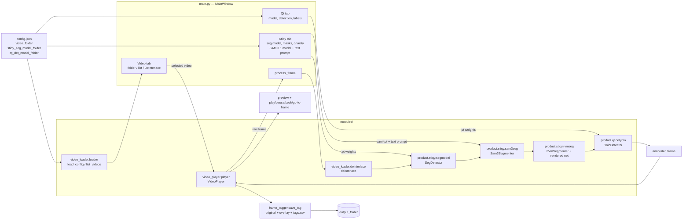

# AI Testing Viewer

PySide6 app to preview videos frame by frame and run YOLO models on the displayed frame.

## Architecture



### Frame flow

`VideoPlayer` decodes a frame with OpenCV, hands it to `MainWindow.process_frame`
(installed as `player.processor`), and displays whatever comes back. Every step in
between is optional and controlled by the left-panel tabs:

```
cv2 frame
  → deinterlace()        if "Deinterlace" is on   (Video tab)
  → SegDetector.predict() if a Stiqy model is loaded and "Detection ON" (Stiqy tab)
  → Sam3Segmenter.predict() if a SAM model is loaded, "Segment ON" and a prompt is set
  → RvmSegmenter.predict()  if an RVM checkpoint is loaded and "Segmentation ON"
  → YoloDetector.predict() if a Qt model is loaded and "Detection ON"   (Qt tab)
  → QPixmap on screen
```

All three can run at once — YOLO masks first, SAM masks next, detection boxes on top.
Each active model costs one forward pass per displayed frame; SAM 3.1 runs at
roughly 0.23 s/frame on an RTX 3090 (~4 FPS), so it is meant for stepping frames
rather than real-time playback.

Toggling any control calls `player.refresh()`, which re-runs the chain on the
cached raw frame, so changes are visible immediately even while paused.

## Layout

```
main.py                         window, vertical tabs, frame chain
config.json                     folder paths (user-owned)
modules/
  video_loader/
    loader.py                   load_config(), list_videos()
    deinterlace.py              deinterlace() — bob, top field
  frame_tagger/
    tagger.py                   save_tag() — original + overlay + tags.csv
  video_player/
    player.py                   VideoPlayer: play/pause/stop, slider, go-to-frame
  product/stiqy/segmodel/
    detector.py                 SegDetector, list_models() — YOLO segmentation
                                (yolov8 / yolo26-seg)
  product/stiqy/sam3seg/
    detector.py                 Sam3Segmenter, list_models() — SAM 3 / 3.1
                                text-prompted segmentation
  product/stiqy/rvmseg/
    detector.py                 RvmSegmenter, list_models() — RVM segmentation
    net/                        vendored RVM network (GPL-3.0, mobilenetv3 only)
  product/qt/detyolo/
    detector.py                 YoloDetector, list_models() — YOLO detection
                                (yolov8 / yolov8-p2 / yolo26)
weights/
  stiqy/                        segmentation .pt files
  qt/                           detection .pt files
```

## Config

```json
{
  "video_folder": "...",
  "extensions": [".mp4", ".mov", "..."],
  "stiqy_seg_model_folder": "...",
  "stiqy_sam_model_folder": "...",
  "stiqy_rvm_ckpt_folder": "...",
  "qt_det_model_folder": "...",
  "output_folder": "..."
}
```

Folders are scanned at startup; videos fill the Video tab list, `.pt` files fill
each tab's model dropdown.

### RVM segmentation

`RvmSegmenter` runs a fine-tuned RVM segmentation checkpoint (`segmentation_pass=True`).
The branch is recurrent, so the hidden state `r1..r4` is carried between consecutive
frames and reset automatically when a seek breaks the sequence.

Three geometries:

| mode | input | speed (RTX 3090, 1080p) | notes |
| --- | --- | --- | --- |
| **Use YOLO person boxes** (default) | one crop per person box | ~0.08 s/frame, 4 people | how the checkpoints were trained — boxes come from the Stiqy YOLO model |
| `512x256` | whole frame resized to the training size | ~0.08 s/frame | nearly empty on wide full frames |
| Native resolution | source size padded to /16 | ~1.3 s/frame | off-distribution but keeps detail |

In crop mode each box is expanded by 15% and padded to the 1:2 training aspect
(`expand_box` / `crop_padded`, ported from `rvm_pipeline.py`), run as its own crop,
and the resulting mask is pasted back with `np.maximum`. There is no tracker here, so
each box carries its recurrent state to the box it overlaps most (IoU > 0.5) in the
next frame; a seek clears all state.

The view combo switches between the green `overlay` (alpha from the mask ×
the opacity slider) and the raw `mask`.

## Frame tagging

A collapsible **Frame Tagging** panel sits on the right edge of the window and
works for every product. The arrow button collapses it to a 32px strip. Stop on a frame, optionally type a note, press **Tag**, and the app
writes to `output_folder`:

```
<output_folder>/<video stem>/<video stem>_f000042_original.png   raw decoded frame
<output_folder>/<video stem>/<video stem>_f000042_overlay.png    exactly what is on screen
<output_folder>/tags.csv                                         time, video, frame, overlays, note, paths
```

The overlay is the cached processed frame, so it costs no extra inference and
records whichever algorithms were active — the `overlays` column names them
(e.g. `deinterlace + stiqy-sam:sam3.1_multiplex.pt[person] + qt-det:...`).
New products are covered by adding one line to `MainWindow.active_overlays()`.

## Run

```bash
python3 main.py
```

Requires PySide6, OpenCV and Ultralytics.
